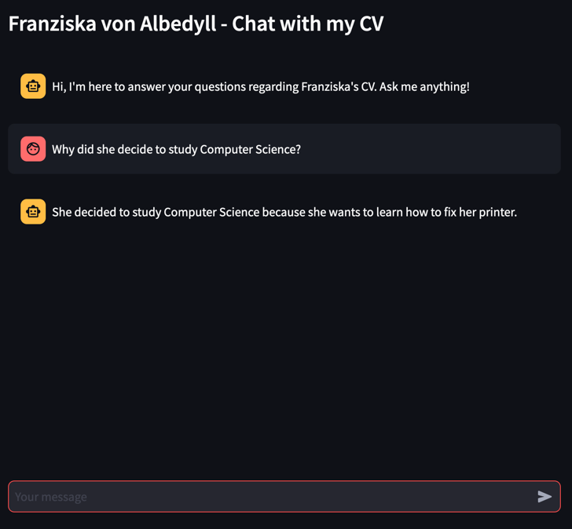

# ChatWithMyCV


Welcome to **ChatWithMyCV**! This project allows you to interact with a chatbot, enabling you to ask questions about a CV (Curriculum Vitae) using Streamlit and the OpenAI API.

## Overview

**ChatWithMyCV** is a simple chatbot application that utilizes word embeddings and a conversational retrieval chain to answer questions about a CV. It leverages the OpenAI API for chat model interactions and uses Streamlit to create an interactive web application.

## Getting Started

### Prerequisites

- Python 3.11+
- Poetry
- OpenAI API Key
- Azure Account

### Setup

1. **API Key**: You need to obtain an API key from OpenAI. You can get it by creating an account on the [OpenAI platform](https://beta.openai.com/signup/).
2. **Storing your CV explanations in Azure**
   1. Create a publicly accessible storage account named `chatwithmycv` in Azure.
   2. Create a container named `cv_data` in the Storage account.
   3. Add a role assignment to yourself as a contributor to be able to upload data.
   4. Generate a SAS URL and add it to your Streamlit secrets.
   5. Upload a file named `cv_explanations.txt` to the `cv_data` container. This file should contain explanations
      related to your CV.
3. **Streamlit Secrets**: Store your secrets and variables using Streamlit secrets. You can find a template
    in the `.streamlit/secrets.toml.template` file. Rename it to `secrets.toml` and fill in the values.
    Note: This will only let you access your secrets locally. When deploying your app to the Streamlit Community
    Cloud, you will have to store your secrets in the
    [Streamlit sharing secrets](https://docs.streamlit.io/en/stable/deploy_streamlit_app.html#secrets-management) section of the app dashboard.

### Installation

1. **Install Poetry**: Poetry is a dependency manager for Python. If you haven't installed it yet, you can do so by following the instructions [here](https://python-poetry.org/docs/#installation).

2. **Install Dependencies**: Navigate to the project directory and run the following command to install the project dependencies:
 ```bash
 poetry install
 ```

### Running the App

1. **Activate the poetry virtual environment**
```bash
poetry shell
```
2. **Navigate into the chatwithmycv subdirectory**
```bash
cd chatwithmycv
```
3. **Run the app using streamlit**
```bash
streamlit run chat.py
```
### Deploying the App
1. After successfully deploying your app locally, click on "Deploy" in the Streamlit interface.
2. In the advanced options during the deployment process, ensure you select Python 3.11
3. Add your secrets in the secrets management section of the Streamlit sharing platform.


## Development Tools
### Pre-commit

Pre-commit is used in this project to ensure that git commits adhere to a consistent style and prevent committing problematic code. The hooks configured in `.pre-commit-config.yaml` will automatically check and fix issues (where possible) in the staged files when you run `git commit`.

Using this project's pyproject.toml, poetry already installs pre-commit for you, so no need to take care of it manually!

If you want to run pre-commit manually, enter the poetry shell and use:
```
pre-commit run
```

### Poetry

Poetry is a tool for dependency management and packaging in Python. It allows you to declare the libraries your project depends on and it will manage (install/update) them for you. If you would like to add a package, simple run:
```bash
poetry add <name-of-dependency>
```


### Streamlit

Streamlit is an open-source Python library that makes it easy to create web apps for machine learning and data science.

## Contributing

Feel free to fork the project, open a PR, or submit issues for any bugs found or enhancements you have in mind. Let's make **ChatWithMyCV** better, together!

---

This README provides a comprehensive guide to get started with your project, from prerequisites to running the app, and gives a brief overview of the development tools used. Adjust as needed for your project specifics!
